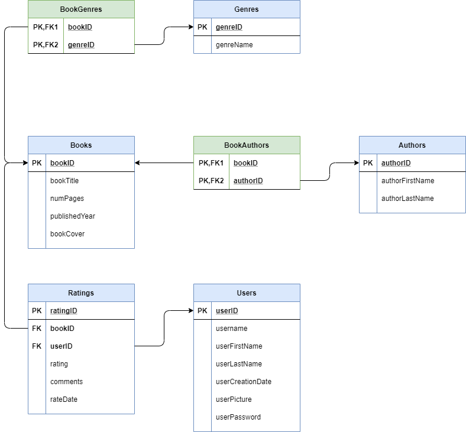

# CS 340 Project UI

The repository showcases the front end implementation my team's project for the CS 340 course (Introduction to Databases) at Oregon State University.

“How’s This Book?” will be a website that allows Oregon State University students (approximately 20,000 `Users` total) to publish `Ratings` for `Books`. The interface of the website will also allow `Users` to access details of `Books`, such as their `Authors` and `Genres`. The primary function of the website is to provide `Users` with a hub to store and access their `Ratings` for `Books`.

The website will be built with Node.js and will utilize a MySQL database. Please see below for the entity-relationship diagram and the database schema.

